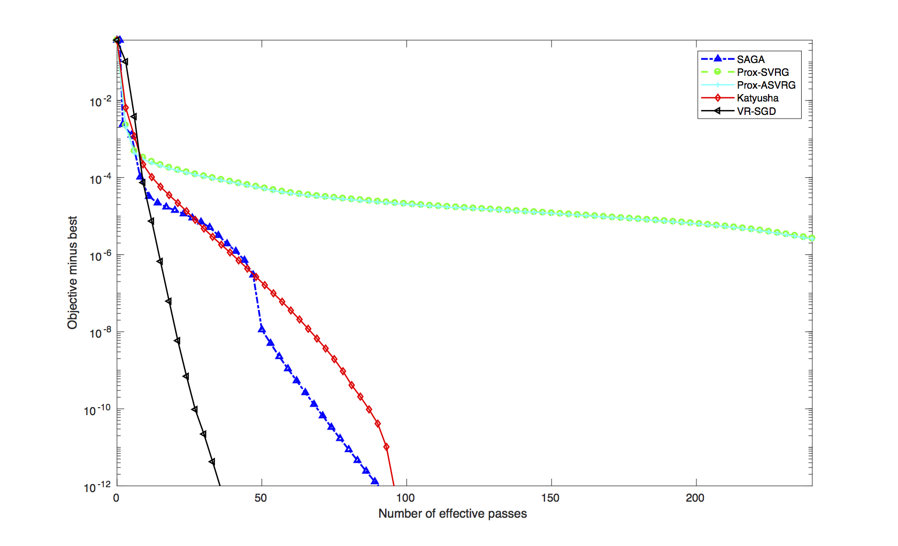

# VR-SGD

A demo for VR-SGD(Comparing to some major algorithms).

Method "VR-SGD" described in the paper: "VR-SGD: A Simple Stochastic Variance Reduction Baseline for Machine Learning", Fanhua Shang, Member, IEEE, Yuanyuan Liu, Kaiwen Zhou, James Cheng, and Ivor W. Tsang.

## Usage

All algorithms are implemented in C++ including SAGA, SVRG, Prox-SVRG, Katyusha, VR-SGD, and all parameters are passed through MATLAB.

To run the demo in MATLAB, first run `mex_all` in the MATLAB terminal to generate the mex file.(Note that the compiler should support `c++11`)

Determine all parameters in a MATLAB file and run the algorithms implemented in C++ by passing parameters through `Interface`, here is a piece of sample code:

```matlab
% load dataset variable X,y

algorithm = 'Prox_SVRG'; % SAGA / SVRG / Prox_SVRG / Katyusha
loop = int64(passes / 3); % loop count for Prox_SVRG

% For SVRG / Prox_SVRG
% Mode 1: last_iter--last_iter  ----Standard SVRG
% Mode 2: aver_iter--aver_iter  ----Standard Prox_SVRG
% Mode 3: aver_iter--last_iter  ----VR-SGD
Mode = 2;

passes = 240; % total passes of train set, must be a multiple of 3

model = 'logistic'; % least_square / svm / logistic

regularizer = 'L2'; % L1 / L2 / elastic_net
lambda1 = 10^(-6); % L2 / elastic_net parameter
lambda2 = 10^(-5); % L1 / elastic_net parameter

L = (0.25 * max(sum(X.^2, 1)) + lambda1); % logistic regression
sigma = lambda1; % For Katyusha / SAGA in SC case, Strong Convex Parameter
step_size = 1 / (5 * L);

init_weight = repmat(0, Dim, 1); % Initial weight

is_sparse = issparse(X);
result = Interface(X, y, algorithm, model, regularizer, init_weight, lambda1, L, step_size, loop, is_sparse, Mode, sigma, lambda2);

```

## Demo
One can run `matlab_test` in the MATLAB terminal, a small demo using Adults dataset from [LIBSVM Data](https://www.csie.ntu.edu.tw/~cjlin/libsvmtools/datasets/).


